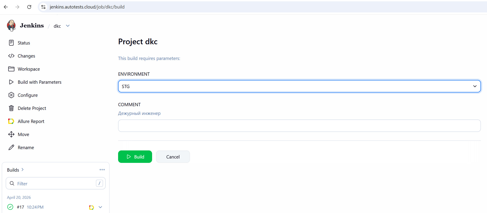
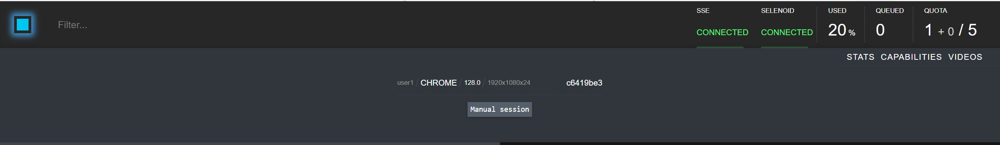
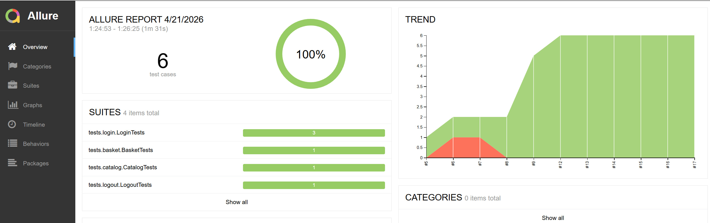
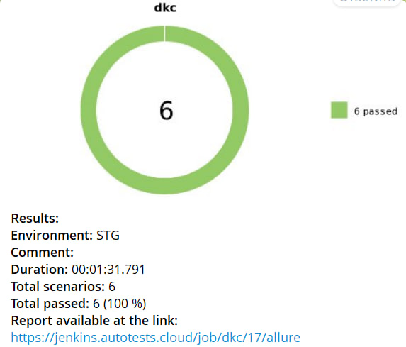

# Проект по автоматизации тестирования интернет-магазина "Клуб ДКС"

---
> Ссылка на  [интернет-магазин ДКС](https://club.dkc.ru/)

<p align="center">

<br>

---
## :hammer_and_wrench:  Технологический стек

<p align="center">
<a href="https://www.jetbrains.com/idea/">

 </a>

<a href="https://www.java.com/">

 </a>

<a href="https://selenide.org/">

</a>

<a href="https://aerokube.com/selenoid/">

</a>

<a href="https://qameta.io/">

</a>

<a href="https://gradle.org/">

</a>

<a href="https://junit.org/junit5/">

</a>

<a href="https://github.com/">

</a>

<a href="https://www.jenkins.io/">

</a>

<a href="https://telegram.org/">

</a>
</p>

Язык: Java 21  
Фреймворки: Selenide, JUnit 5  
Сборка: Gradle 8.x  
Отчетность: Allure Report  
Инфраструктура: Jenkins, Selenoid (Docker)  
Уведомления: Telegram Bot  
Библиотеки: Assertj (агенты)  

---
## :open_file_folder: Инфраструктура проекта
### 1. [Jenkins CI/CD](https://jenkins.autotests.cloud/job/dkc/)
   Настроен Pipeline для сборки проекта и прогона тестов по тегам.
<p align="center">

<br>

### 2. [Selenoid (Удаленный запуск браузеров)](https://selenoid.autotests.cloud/#/capabilities/)
   Тесты запускаются в изолированных Docker-контейнерах. Selenoid позволяет наблюдать за выполнением теста в реальном времени.
<p align="center">

<br>

---
## 📊 Мониторинг и отчетность
### 1. :chart_with_upwards_trend: [Allure Report](https://jenkins.autotests.cloud/job/dkc/allure/)
   Подробные отчеты с шагами выполнения, скриншотами и исходным кодом страницы в случае падения.
<p align="center">  
  
</p> 

### 2. 🔔 [Уведомления в Telegram](https://t.me/+amlXV4MQZqM5NDRi)  
   После каждой сборки бот присылает краткий отчет со статистикой прохождения тестов.
<p align="center">

<br>

### 3. 🎥 Видео выполнения тестов  
Использование Selenoid позволяет не только наблюдать за тестами в реальном времени, но и автоматически записывать видео каждого прогона. Это значительно ускоряет анализ причин падения тестов.
<p align="center">
<video src="media/video/videoReport.mp4" width="950" height="400" controls muted>
</video> 
</p>


<p align="center">
<video src="media/video/vid.mp4" width="950" height="400" controls muted>
</video> 
</p>

<p align="center">
<video src="media/video/vid.gif" width="950" height="400" controls muted>
</video> 
</p>

<p align="center">
<video src="media/video/vidd.mp4" width="950" height="400" controls muted>
</video> 
</p>

<p align="center">
<video src="media/video/vidd.gif" width="950" height="400" controls muted>
</video> 
</p>

---
### 🚀 Запуск автотестов  

Локальный запуск  
```bash
gradle clean test
